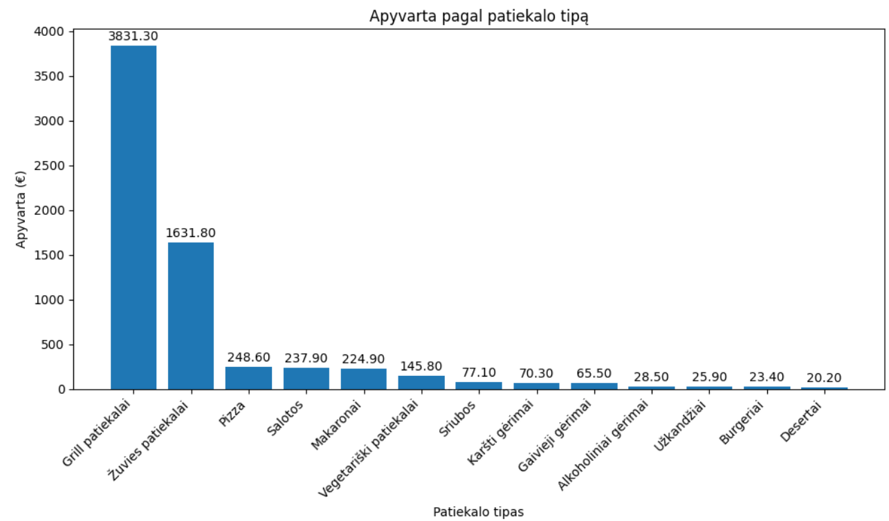
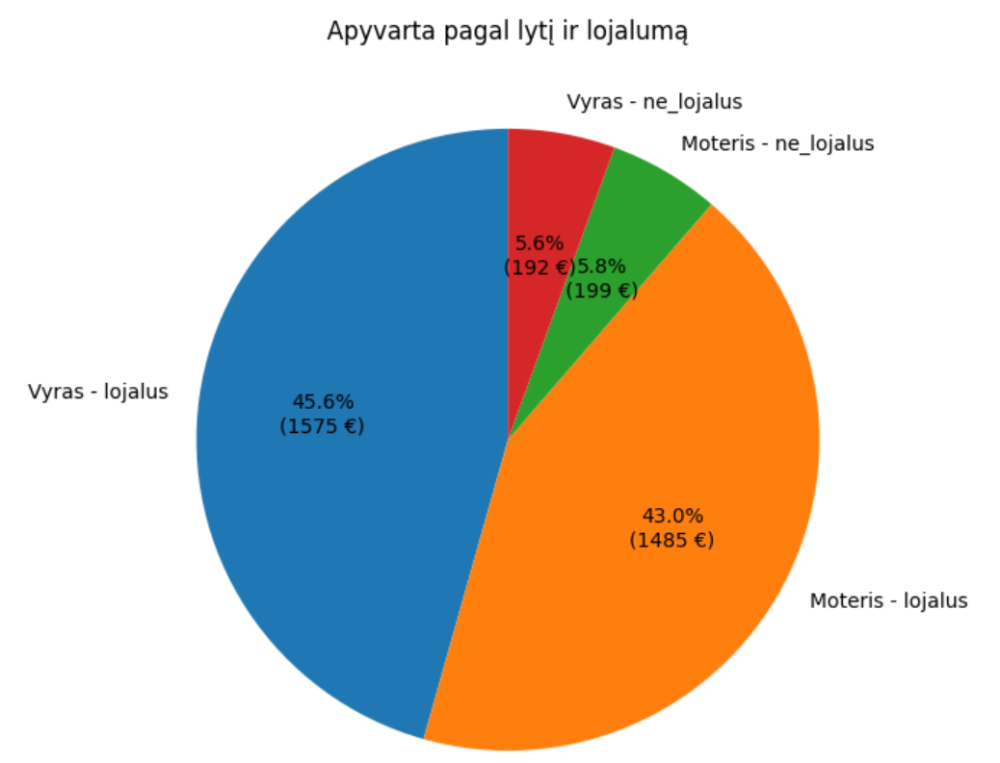
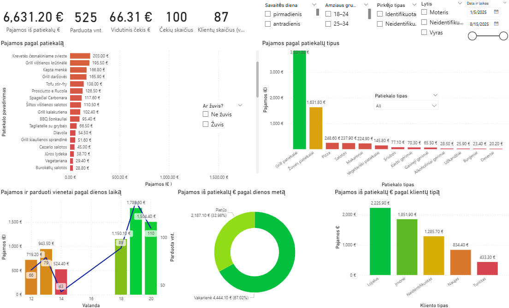
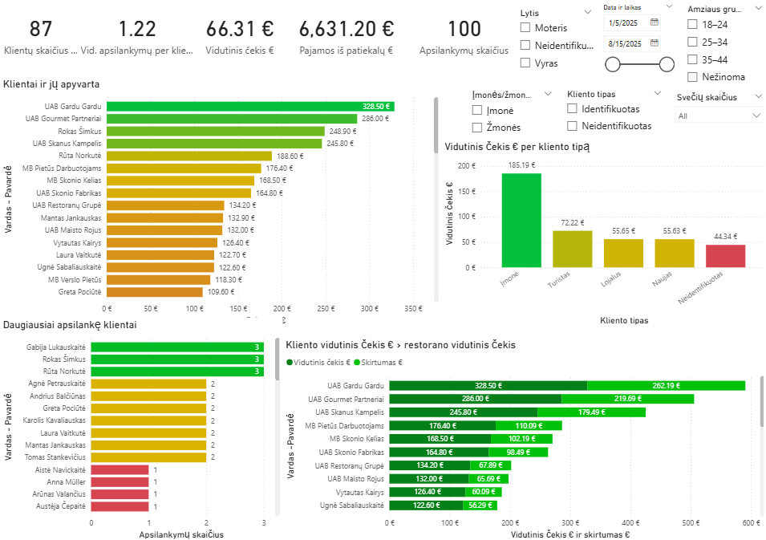
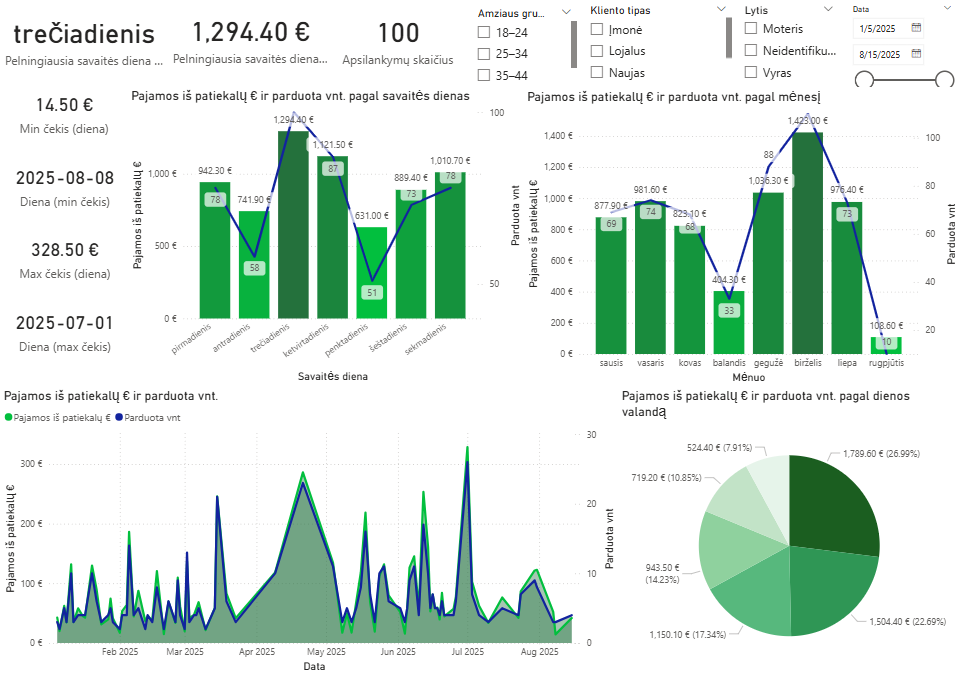
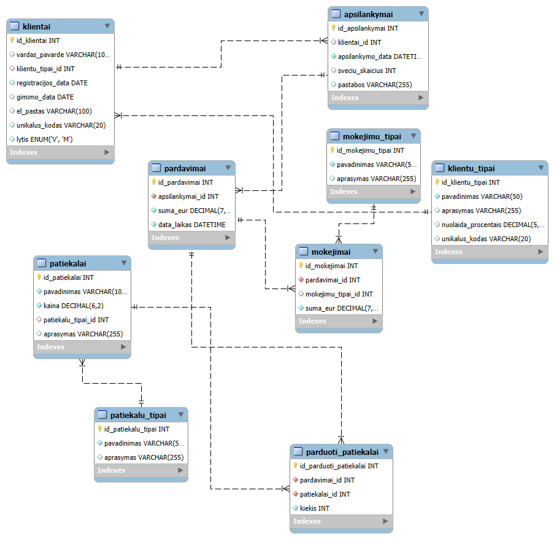

# Vilnius-Coding-School-Final-Project
MySQL portfolio project: complete restaurant database with schema, SQL queries (joins, group by, subqueries, case/if), a Jupyter Notebook with Pandas analysis & visualizations, and an interactive Power BI dashboard.

[](https://www.python.org/)
[](https://www.mysql.com/)
[](https://jupyter.org/)
[](https://pandas.pydata.org/)
[](https://powerbi.microsoft.com/)

## Description
This project simulates a restaurant management system and demonstrates analytical queries in three ways:
- **SQL** – executed directly in MySQL
- **Pandas** – reproducing the same logic in Python (using joins, groupby, and aggregations)
- **Power BI** – interactive data visualization and dashboard creation

The project includes: database schema, seed data, analytical SQL queries with comments, a Jupyter Notebook with Python/Pandas implementations, visualizations created with Matplotlib, and an interactive Power BI report.

---

## Functionality
This project enables the following business and analytical insights:

- **Revenue analysis by dish category** – total turnover and quantity sold per dish type.
- **Top 10 best-selling dishes** – ranked by generated revenue.
- **Dish-level revenue tracking over a time window** – e.g., last 7 days, with thresholds (HAVING).
- **Average check by customer type** – loyalty groups, tourists, etc.
- **Customer contribution analysis** – ranking clients by total revenue (with LIMIT and OFFSET).
- **Top individual clients (excluding companies)** – filtered by client type.
- **Check statistics** – minimum, maximum, and average check values in a time range (with subqueries).
- **Profitability by weekday** – identify the most profitable day of the week.
- **Revenue split by gender and loyalty** – segmentation with IF conditions.
- **Revenue by age groups** – using CASE statements for brackets.
- **Most frequent visitors** – customers with the highest visit counts and revenue.
- **Meal-time analysis** – lunch vs dinner vs other periods (time-based CASE).
- **Peak hours** – hours of the day with the highest sales and average checks.
- **High-value customers** – clients whose average check exceeds the restaurant-wide average.
- **Seasonality insights** – best-selling dishes during summer (or any defined season).

Each functionality is implemented in both:
- **SQL** (using `JOIN`, `GROUP BY`, `HAVING`, `CASE/IF`, subqueries, etc.)
- **Pandas** (using `merge`, `groupby`, `agg`, conditional columns, etc.)
- **Power BI** (interactive visuals, filters, slicers)

---

## Features
- Complete **relational database schema** (`Schema/Schema.sql`)
- **Seed data** with realistic customers, orders, and dishes (`Seeds/Seed.sql`)
- **15 analytical SQL queries** (`Queries/`) with clear comments
- **Jupyter Notebook** (`Notebooks/Restaurant_SQL_vs_Pandas.ipynb`):
  - Same analysis in SQL & Pandas
  - Matplotlib-based data visualizations
- **Power BI Dashboard** (`PowerBI/Restaurant_Dashboard.pbix`):
  - Interactive report with filters, drill-downs & KPIs
- **EER diagram** of the database (`Schema/EER.png`)

---

## Installation and Run
Make sure you have **Python 3.10+** (tested on 3.13.5) and **MySQL 8.0+** installed.  
Dependencies can be installed directly in Jupyter Notebook:

```python
%pip install mysql
%pip install mysql-connector-python
%pip install matplotlib
%pip install pandas
```

Steps to set up and run:
1. Import the schema and seed data into your MySQL database:
   ```sql
   SOURCE Schema/Schema.sql;
   SOURCE Seeds/Seed.sql;
   USE restoranas_db;
   ```
2. Open the Jupyter Notebook:
   ```bash
   jupyter notebook ./Notebooks/Restaurant_SQL_vs_Pandas.ipynb
   ```
3. Run the cells to execute SQL queries and compare results with Pandas.
4. Open PowerBI/Restaurant_Dashboard.pbix in Power BI Desktop for interactive analytics.

---

## Example Outputs

Sample analysis — revenue by dish type:

| patiekalo_tipas     | pajamos_eur | kiekis_vnt |
|---------------------|-------------|------------|
| Grill patiekalai    | 3831.30     | 241        |
| Žuvies patiekalai   | 1631.80     | 100        |
| Pizza               | 248.60      | 23         |


Revenue by dish type:



Revenue by gender and loyalty:



**Power BI Dashboard Preview**

Revenue by dish type: 



Customers view:



Time overview:


---

## Project Structure
```
Vilnius-Coding-School-Final-Project/
│── Schema/       # Database schema + EER diagram
│── Seeds/        # Seed data
│── Queries/      # Analytical SQL queries
│── Notebooks/    # Jupyter Notebook (SQL + Pandas + Visualizations)
│── PowerBI/      # Power BI Dashboard + Images
│── README.md
```
---
## EER Diagram
To better understand the database design:



---

## Notes
- Tested on **Python 3.13.5**
- Works with **MySQL 8.0+**
- Dependencies: mysql-connector-python, pandas, matplotlib, numpy, powerbi-desktop

---

## License
This project is licensed under the [MIT License](./LICENSE).

---

## Author
Created as a **final project** for Vilnius Coding School.  
Developed by **Martynas Talmontas** as part of SQL/Python/Power BI data analysis learning path. 

---

## Contacts
- GitHub: [martal0824](https://github.com/martal0824)
- LinkedIn: [Martynas Talmontas](https://www.linkedin.com/in/martynas-talmontas/)
- Email: martalmontas@gmail.com
